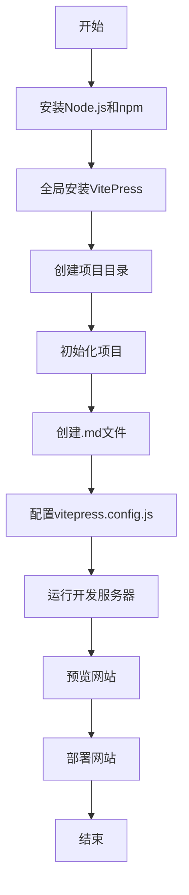

# 页面测试
==增加页面修改测试==

==测试build自动化==

哈喽大家好
一句话
我是主播大杨，由我和搭档钱钱共同策划的这档节目《新手爸妈》终于上线啦！

==我们会通过播客的形式，记录并分享自己作为新手爸妈的故事，同时把我们的心得与经验分享给小伙伴。==

希望大家喜欢～

## 节目地址

[EP1 为什么策划这档节目](https://www.xiaoyuzhoufm.com/episode/66b60f72db5e6d6bf925bd2e)

## todo list
- [ ] 吃饭
- [ ] 睡觉
- [x] 打豆豆

> 引用
> 测试引用

## container
> [!NOTE] note
>
> 测试容器块

> [!tip] 提示
> 测试容器块

> [!warning] 警告
> 测试容器块
> 

> [!danger] 危险
> 测试容器块
> 

## highlight
==测试高亮==
<mark> 测试高亮 </mark>

## 测试引用角标

《新手爸妈》[^1]
[^1]: [EP1 为什么策划这档节目](https://www.xiaoyuzhoufm.com/episode/66b60f72db5e6d6bf925bd2e)

## 测试嵌入视频

<iframe src="https://player.bilibili.com/player.html?isOutside=true&aid=267161715&bvid=BV1jY411Y72d&cid=1029451528&p=1" scrolling="no" border="0" frameborder="no" framespacing="0" allowfullscreen="true"></iframe>

## 测试mermaid语法

## 双向链接测试

[[dify学习]]
